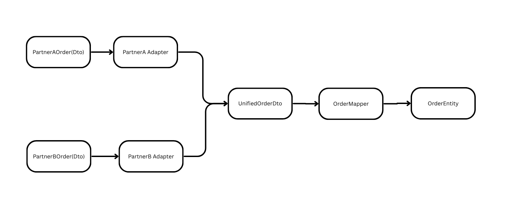

# How to Run and Check
- Used H2 database in Postgres mode since you don't need to setup postgres credentials seperately.(for zero-config local development)
- Used flyway for migrations to ensure consistent DB state. 
- Used mapsruct for dto mapping.
- Used lombok to avoid boiler plate getter setters.

## TODO
- [ ] Build React front end for visualization and monitoring.
- [ ] Have to write more unit tests in backend.

### Prerequisites
* **Java 21** (Required)
* Maven (Optional, wrapper included)

### 1. Run the Application
Use the included Maven Wrapper to start the app without installing Maven manually.
```bash
# Mac/Linux
./mvnw spring-boot:run

# Windows
mvnw.cmd spring-boot:run
```

### 2. Test the API
For detailed testing instructions and curl commands, see [TestCommands.md](TestCommands.md).

---
## Design Considerations
- **Database Choice: Why Relational (SQL)?**
  I chose a Relational Database (PostgreSQL/H2) over NoSQL for specific reasons:
  * **Complex Aggregations:** The requirements demanded "Monthly Sales Summaries" and "Date Range Searches." SQL excels at `SUM`, `COUNT`, and `GROUP BY` operations. Doing this in NoSQL often requires inefficient table scans or external analytics tools.
  * **ACID Compliance:** Financial data requires strict transaction guarantees. If an order is saved, it must be queryable immediately and consistently.
  * **Structured Data:** The `OrderEvent` schema is rigid and well-defined, making it a perfect fit for a relational schema.

- **Used DECIMAL instead of FLOAT or DOUBLE**  
  Floating-point types can introduce precision errors due to how they are represented in binary.  
  DECIMAL ensures exact precision, which is critical for values like financial data or identifiers.

- **Used constraints to assign a single sequence number per partner**  
  Database constraints (such as UNIQUE or composite keys) were applied to guarantee that each partner is assigned only one sequence number, ensuring data integrity and preventing duplicates.
- **Preventing duplicates**
  * **Solution:** Partners may retry requests, leading to duplicate orders. The sequence_number is generated internally, so standard unique constraints fail. Enforced uniqueness on {PartnerID + ProductID + EventTime}.
  * **Trade-off:** If a partner genuinely sells the same product at the *exact millisecond* (highly unlikely for a single user interaction), it is rejected.

- **Used Adapter Design Pattern**
  Instead of generally ingesting dtos thorugh mapper, which makes the code more modular.
  If a new partnerC joins, creating a PartnerCOrderAdapter is enough and zero changes to the serice logics.

  

- **Factory Design Pattern**
  To adhere to the **Open/Closed Principle** (SOLID), I implemented the **Factory Design Pattern** to manage partner integrations.

  * **Problem:** Without a factory, the service layer would require messy `if-else` blocks to select the correct logic for each partner (e.g., `if (partner == "A") useAdapterA()`). Adding a new partner would require modifying core service code.
  * **Solution:** I created a `PartnerAdapterFactory`.
      * **How it works:** The factory automatically detects all available `PartnerOrderAdapter` components at startup and stores them in a map.
      * **Usage:** The `OrderIngestionService` simply asks the factory: *"Give me the adapter for Partner X."*
      * **Benefit:** To add "Partner C," we simply create a new `PartnerCOrderAdapter` class. **Zero changes** are needed in the Service layer or the Factory itself.

- **Producer-Consumer Pattern:** Decoupled the **Ingestion API** (Controller) from the **Processing Logic** (Database Writes) using an in-memory `BlockingQueue`.
    * **Benefit:** The API responds immediately with `202 Accepted`, ensuring high throughput and low latency for partners. Heavy database operations happen asynchronously in background threads.
    * **Cloud Path:** In a production AWS environment, this in-memory queue would be replaced by **Amazon SQS** or **Kafka** to ensure durability across restarts.

- **Sequence generation per partner**
  To make sure we get the relevant next sequence number for a partner faster, I have implemented in-memory caching with database backup. If the system is running continously we will have quick lookup from in-memory cache(HashMap) or else if the app restarts, it will fetch the last sequence from database.
  Also Lazy loading enabled, only the sequence numbers are obtained from the database only when a order comes.
  * **Cloud Fix:** We can use redis for caching if we deploy it as a distributed system.

- **Security Strategy**
  * **Stateless Authentication:** We implemented a custom `ApiKeyAuthenticationFilter` rather than session-based auth (Cookies).
    * **Reason:** REST APIs for B2B integration should be stateless. It allows the backend to scale horizontally without worrying about "Sticky Sessions."
    * **Implementation:** Keys are validated against a secure store (currently a map, but would be AWS Secrets Manager in production) before the request hits the business logic.